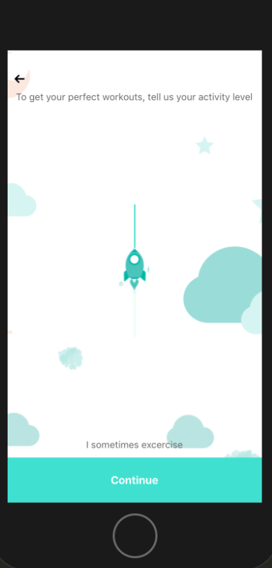

###How to Build and run the app:

1) npm install

2) react-native run-ios

###App

It has the following screens:

1) landing screen
2) due date entry screen
3) activity level entry screen
4) success screen to recap those entries

####Users will be asked to enter 3 pieces of information:

Their ####goal, which is entered via the checks in the landing screen, with one of four values:

1) find_workouts for Find workouts for my pregnancy
2) maintain_weight for Not to gain unnecessary weight
3) birth_preparation for Prepare for birth
4) feel_relaxed for Feel more relaxed

Their ####due_date, which we expect to be a date, no earlier than today, and not more than 9 months in the future

Their ####activity_level, how often they exercise - slider, should go from 1 to 5 and shows a text description for every 
level:

1: I don’t exercise.
2: I rarely exercise.
3: I sometimes exercise.
4: I regularly exercise.
5: I often exercise.

When a user completes their entries, they will see a success screen, which summarizes the information they have entered.

## Result

    

